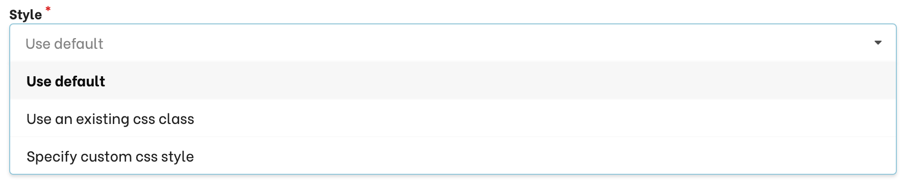

import { FaEllipsisV } from "react-icons/fa";

Available in: <Premium plan="Botfront Cloud" /> <Premium plan="Botfront Enterprise" />

# On screen guidance

On screen guidance combines conversational logic with on screen indications.
You can use it to implement in-app onboarding, training or support, product tours, etc.

## Prerequisite

We recommend using Chrome with the [Get Unique CSS Selector](https://chrome.google.com/webstore/detail/get-unique-css-selector/lkfaghhbdebclkklgjhhonadomejckai) extension installed.

This extension allows to quickly find and copy CSS selectors (unique identifiers of elements on your page)

## Highlighting elements on the screen.

Let's do something similar to the demo you can find on our website. The visitor can ask to start the demo, and the first step is to highlight the **Resources** menu.

### 1. Let's first create our story

[Watch a video](https://drive.google.com/file/d/1UWtoo6tRa9eN_F3z4UsqkM8vZV4b_dQ1/view?usp=sharing)

<video autoplay muted loop width="100%" controls>
  <source src="../../videos/guiding_start_story.m4v" type="video/mp4"/>
  Your browser does not support the video tag.
</video>

### 2. Enable the chrome extension

Now we need to let Botfront know which element of the page to highlight.
Open your website in a different tab and enable the chrome extension you installed in the previous step by clicking the icon in your extensions bar.
You should see a small blue rectangle: [Watch a video](https://drive.google.com/file/d/1dnpw-jXvsujbBGyK2NNp74vHKloCqNh1/view?usp=sharing)

<video autoplay muted loop width="200px" controls>
  <source src="../../videos/guiding_enabling_extension.m4v" type="video/mp4"/>
  Your browser does not support the video tag.
</video>

### 3. Get your selector

Now that your extension is enabled, you can find the _selector_ of the **Resources** menu item: hover it with your mouse, **right-click** and select **Copy unique selector to clipboard**:

[Watch a video](https://drive.google.com/file/d/18KLYkq_nZPRu_TQFVr-I5m-3W1GNt-Lz/view?usp=sharing)

<video autoplay muted loop width="100%" controls>
  <source src="../../videos/guiding_selecting_css.m4v" type="video/mp4"/>
  Your browser does not support the video tag.
</video>

### 4. Create your highlight

Back to your story, you can paste (`Cmd/Ctrl + V`) the selector copied above as shown below:

[Watch a video](https://drive.google.com/file/d/1E3VxuJl3kuVmqe2esZErYu5Y48dS7aIq/view?usp=sharing)

<video autoplay muted loop width="100%" controls>
  <source src="../../videos/guiding_create_highlight.m4v" type="video/mp4"/>
  Your browser does not support the video tag.
</video>

**Train** your bot and see the result:

[Watch a video](https://drive.google.com/file/d/1dgeRN5ymB7QN7-_tKZAJJHy8X8QRsIpZ/view?usp=sharing)

<video autoplay muted loop width="100%" controls>
  <source src="../../videos/guiding_highlight_result.m4v" type="video/mp4"/>
  Your browser does not support the video tag.
</video>

### 5. Showing the tooltip

When showing things oon screen, you generally want the chat widget to be closed and the message attached to the higlighted element.
To do this, simply force close the widget on your message.

[Watch a video](https://drive.google.com/file/d/1Mg0Ao0T1DzA2hvCaNpKk-UWY33AJtSvm/view?usp=sharing)

<video autoplay muted loop width="100%" controls>
  <source src="../../videos/guiding_force_close.m4v" type="video/mp4"/>
  Your browser does not support the video tag.
</video>

And the result: [Watch a video](https://drive.google.com/file/d/1xvZ6gJLtQ5_ctpHhIB58NcYBvm_tUw9Z/view?usp=sharing)

<video autoplay muted loop width="100%" controls>
  <source src="../../videos/guiding_highlight_result_with_tooltip.m4v" type="video/mp4"/>
  Your browser does not support the video tag.
</video>

### 6. Customizing the hightlighting style

By default, Botfront will surround the DOM element you specify with a blinking green rectangle. You can change that is different ways:

- You can write CSS directly in Botfront
- You can specify the name of an existing CSS class on your site.

### 7. Handling responsiveness

If you site or app is responsive, some selectors will be available only at certain screen sizes.
In our example, the **Resources** menu item is hidden under the _hamburger_ menu on mobile. To access **Resources** you need to open the _hamburger_ first:

[Watch a video](https://drive.google.com/file/d/1D_mUpIbrfhk88CrhlJQATlcO-j_tbg47/view?usp=sharing)

<video autoplay muted loop width="100%" controls>
  <source src="../../videos/guiding_highlight_responsive.m4v" type="video/mp4"/>
  Your browser does not support the video tag.
</video>

To support both mobile and desktop screen sizes, you can add several **selectors** separated with a comma: one selector for the **Resources** menu item and one for the hamburger, as shown in the following video:
Proceed as in [step 3](#3-get-your-selector) above to retrieve the _hamburger_ selector. Just resize your browser until the hamburger appears.

[Watch a video](https://drive.google.com/file/d/1--KmRnm6lnEhtUjmrBby700nzAJnRfwh/view?usp=sharing)

<video autoplay muted loop width="100%" controls>
  <source src="../../videos/guiding_highlight_responsive_selectors.m4v" type="video/mp4"/>
  Your browser does not support the video tag.
</video>

<Important type="info">
When multiple selectors are added to a highlight, the tooltip will be attached to the chat widget launcher, and not to the highlighted element.
</Important>

