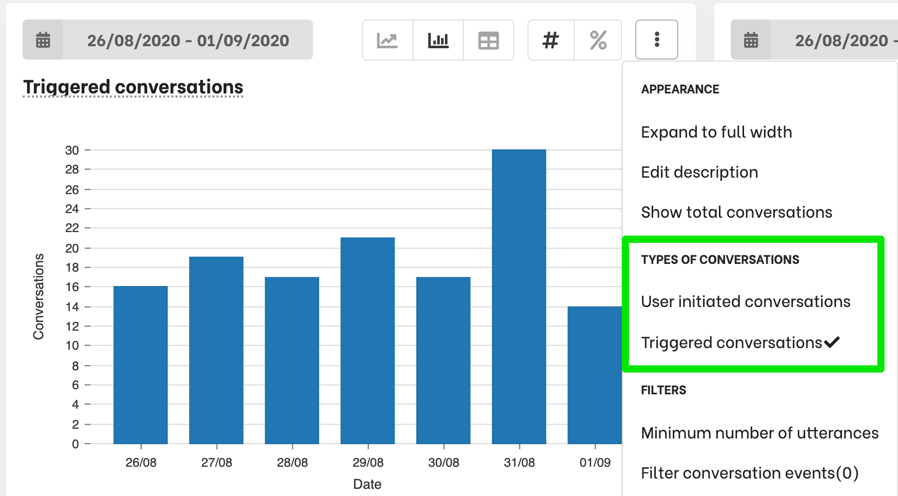
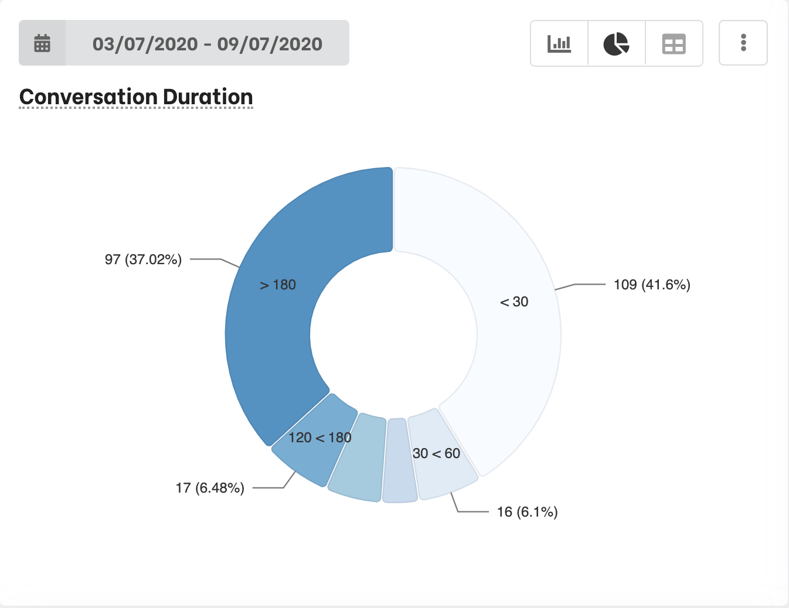
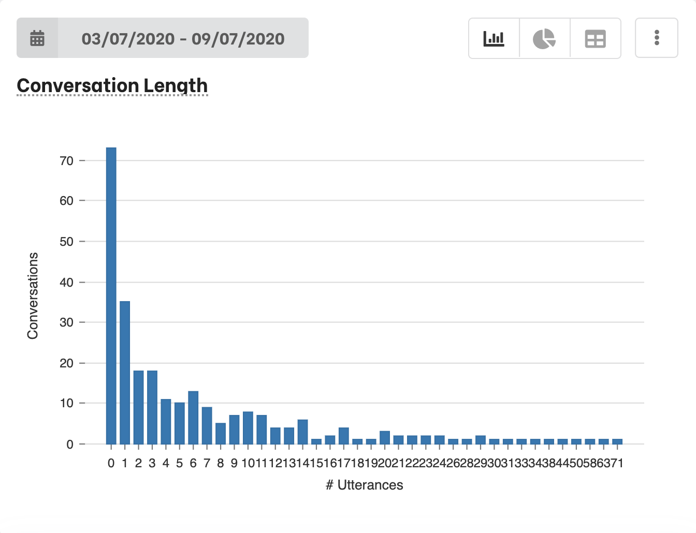
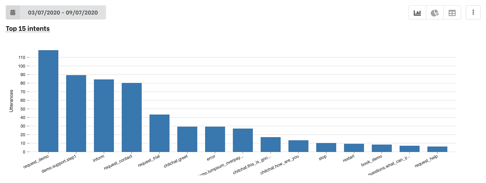
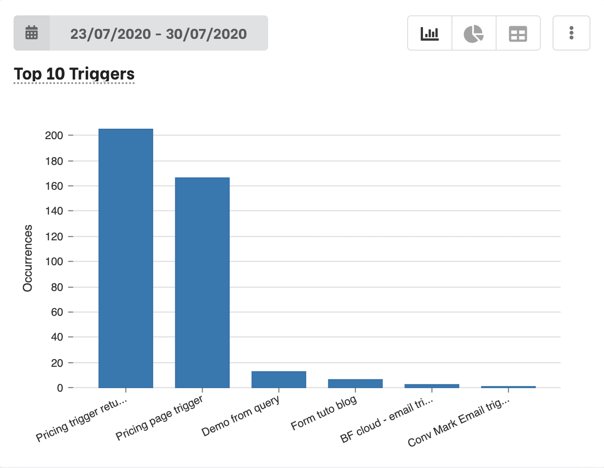
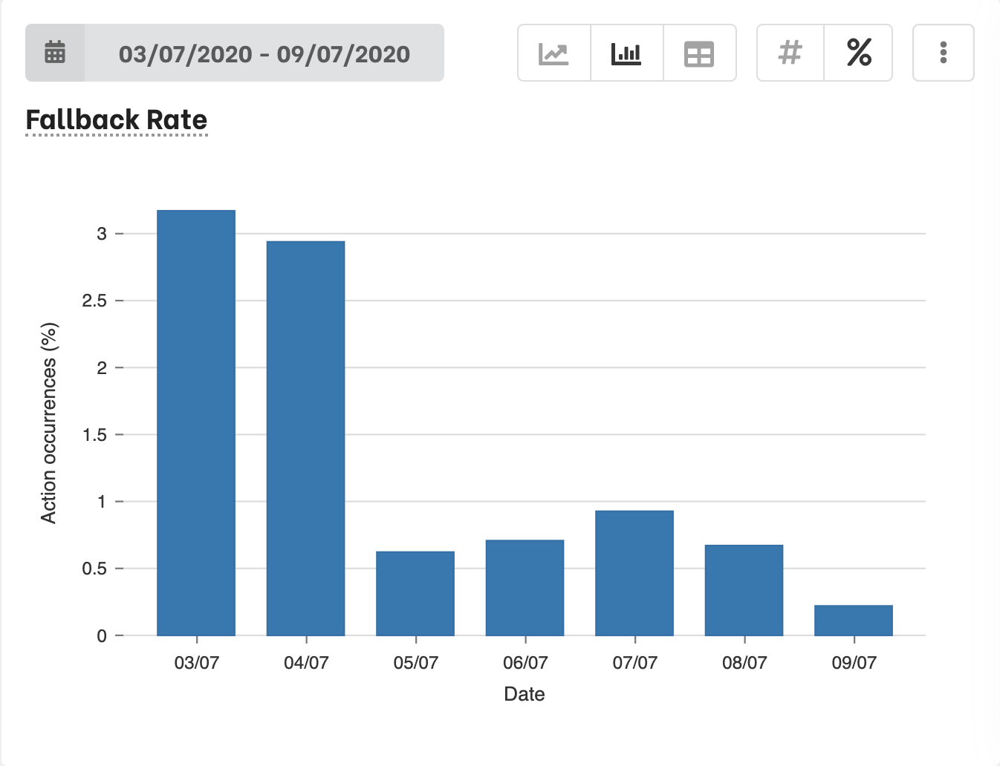
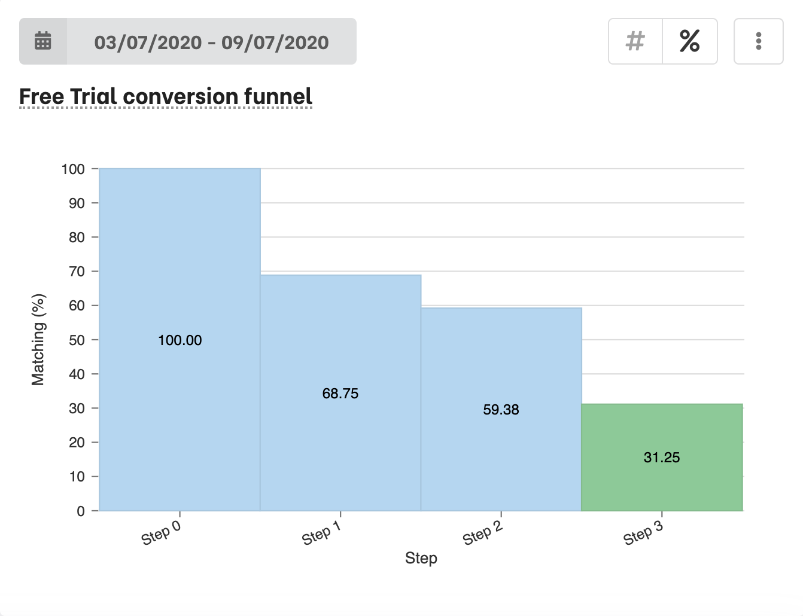
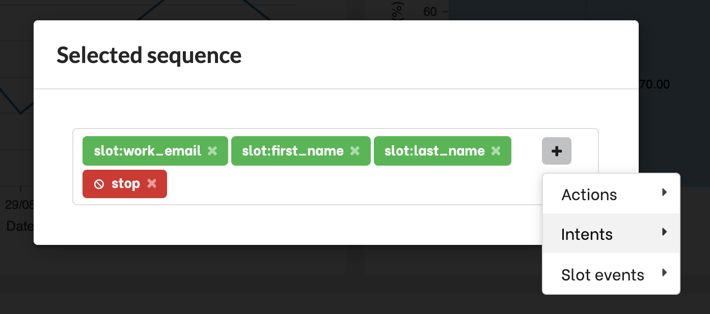

import { FaEllipsisV } from 'react-icons/fa';

# Analytics

Botfront offers a flexible analytics dashboard to monitor your Rasa assistant. You can add, rearrange, and customize analytics cards in your dashboard.
You can the same cards several times with different parameters with a different title.

The following video illustrates how you can create two different _Conversations over time_ widgets, one accounting triggered conversations, and one accounting for user initiating conversations with a `get_started` intent.

<video autoplay muted loop width="100%" controls>
  <source src="../../videos/analytics-multicards.m4v" type="video/mp4"/>
  Your browser does not support the video tag.
</video>

Another important feature of most cards is that using the bar view you can jump to the matching conversations and inspect them.

<video autoplay muted loop width="100%" controls>
  <source src="../../videos/analytics-link-to-conversations.m4v" type="video/mp4"/>
  Your browser does not support the video tag.
</video>

## Export and download

You can download a `.csv` file for all cards from the <FaEllipsisV /> menu.

You can also download an Excel file containing the data of each card in a separate sheet.

## Conversations over time
This card displays the evolution of the number of conversations over time.

You can customize this card with filters to monitor user engagement by comparing **matching conversations** to **total conversations**. 

### Total conversations

You can enable the types of conversations used to calculate the **total conversations** in the <FaEllipsisV /> menu:

- Conversations initiated by the user (when the user sends a message or opens a chat widget)
- Conversations initiated by the assistant (see [proactive conversations](/guide/proactive_conversations/behavioral.md))

### Matching conversations

The filters below (**Minimum number of utterances** and **Filter intents and actions**) will create a subset of those conversations. Those are referred as **matching conversations**.

You can then measure engagement in the table view as well as in the chart views. In the example below, we consider a user engaged if the number of user utterances in a conversation is >= 2.

<video autoplay muted loop width="100%" controls>
  <source src="../../videos/analytics-cot1.m4v" type="video/mp4"/>
  Your browser does not support the video tag.
</video>

The total number of conversations appears in red in the chart when **Show total conversations** is enabled.
The filtered conversations appear in blue in the chart.

### Parameters

| Parameter             | What it does |
| --------------------- | ------------ |
| **Show total conversations** | Display the total number of conversations of the selected type on the chart. |
| **User initiated conversations** | Display conversations initiated by a user message (or an starting intent such as the [`initPayload`](/guide/channels/webchat.md#page-specific-intro-message) in the chat widget). |
| **Triggered conversations** | Display conversations [initiated proactively](/guide/proactive_conversations/behavioral.md). |
| **Minimum number of utterances** | Display conversations with at least a certain number of user utterances. Since the first utterance is generally triggered by the channel to display a welcome message (see [`initPayload`](/guide/channels/webchat.md#page-specific-intro-message)), it is ignored. Which means the typical `get_started` utterance triggered by the `initPayload` or other channels such as [Facebook Messenger](https://botfront.io/docs/channels/messenger) does not count as a user utterance. |
| **Filter conversation events** | Display conversations including or excluding a set of intents and actions. |

## Conversation duration

This card displays conversations grouped by the amount of time between the first and the last user utterance or bot response in the conversation.

## Conversation length

This card displays the number of times a user interacted with the chatbot during a conversation. Conversations within the date range are grouped by the number of user utterances they contain. The number of user utterances is counted from the second as the first is usually sent by a smart trigger or an automatic event which is not related to a user engaging with the chatbot.

## Top intents

This card displays the number of times an intent was used in the selected date range. Intents sent by a smart trigger (see [proactive conversations](/guide/proactive_conversations/behavioral.md)) are excluded from this card.

| Parameter             | What it does |
| --------------------- | ------------ |
| **Included intents** | Only display intents that are listed in this filter |
| **Excluded intents** | Do not display intents listed in this filter |
| **Display limit** | Set a maximum number of intents to display on the bar or pie chart. This parameter does not affect the table view or the download. |

## Top triggers

This card displays the number of times a story with a smart trigger (see [proactive conversations](/guide/proactive_conversations/behavioral.md)) was activated by that trigger in the selected date range.

| Parameter             | What it does |
| --------------------- | ------------ |
| ** Display limit** | Set a maximum number of triggered stories to display on the bar or pie chart. This parameter does not affect the table view or the download. |

## Action occurrences over time

This card displays the number of times an action was triggered in a conversation within the selected time period grouped by the conversation's end time.
A common use case is to use this widget to measure fallbacks frequency.

| Parameter             | What it does |
| --------------------- | ------------ |
| **Included actions** | Only count the actions added to this filter as action occurrences. |
| **Excluded actions** | Actions added to this filter will not be counted as action occurrences. |

## Conversations funnel

This card tracks engagement and drop-off over an ordered sequence of events.

The matches are instances where the sequence of event inclusions and exclusions specified in the selected sequence filter are found in order in a conversation. 

The engagement of a triggered story can be measured by starting the selected sequence with the action or bot response that immediately follows the start of the story.

Note that bot responses in a form are not a valid method for tracking engagement and slots should be used instead.

| Parameter             | What it does |
| --------------------- | ------------ |
| **Selected sequence** | Add intents and actions to this filter by clicking on the button with a plus icon and selecting an event from the dropdown. Alternatively type the event you want to add into the search bar and press enter. Events in this filter can be marked as included (green) or excluded (red). To toggle between these options, click the event label in the sequence filter. |
| **Selected sequence (inclusion)** | Included events must be found in the conversation after all the previous events in the sequence. |
| **Selected sequence (exclusion)** | Excluded events must not be found between the previous event and the next event or the end of the conversation if it is the last event in the sequence. |

The sequence can be made of intents, actions and slot events. Steps can be negated if you want to track sequence where a particular event didn't occur.

