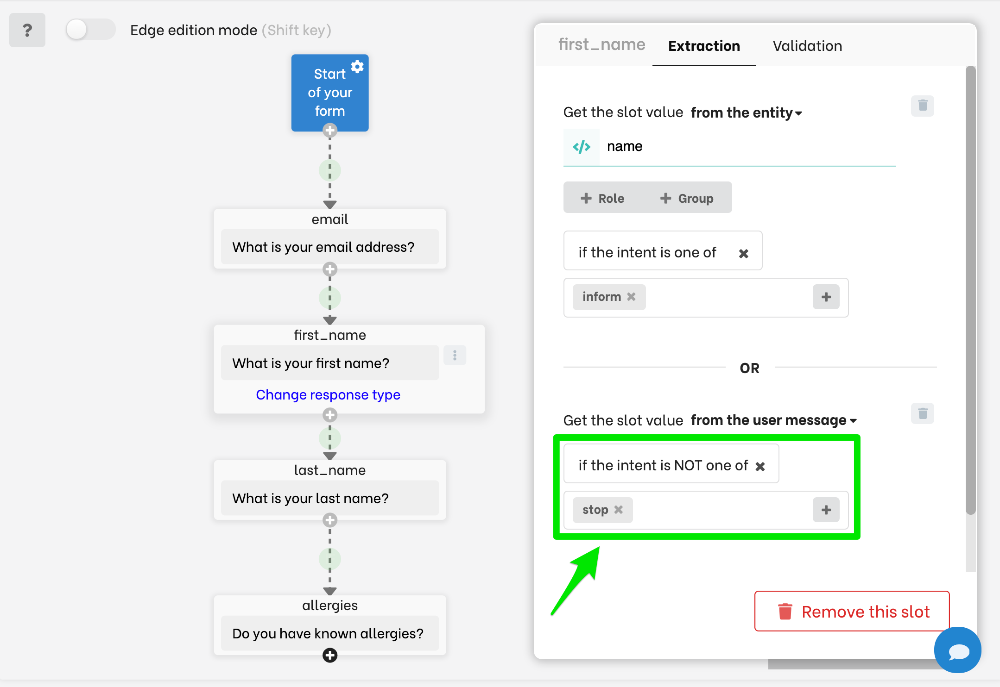
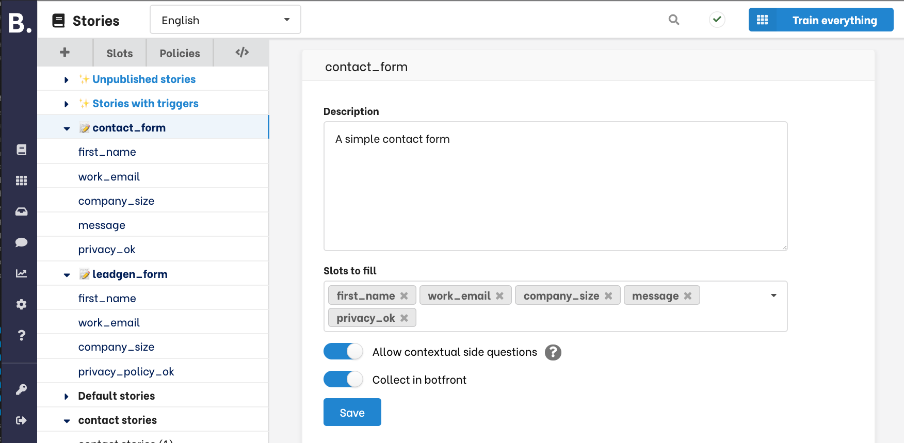

Available in: <Premium plan="Botfront Cloud" />  <Premium plan="Botfront Enterprise" />

# Forms, slot filling, and business logic

[An in-depth step-by-step tutorial is available here.](/guide/rasa/stories/getting_started.md) We recommend starting there and use this documentation article as a reference.

Stories are great to model conversation flows but they lack essential features to implement strong and enforceable business logic.

A simple business logic might be to collect the necessary information to prepare an API call, ensure this information is correct and notify the user when it's not.
Advanced business logic can take the form of a decision tree where the next question to be asked depends of an arbitrary combination of previous responses.

Rasa forms, the `FormAction` and the `FormPolicy` are the official response however they rely heavily on code and lack the simplicity and readability of stories.

Forms in Botfront expose all the advanced Rasa Forms capabilities in a simple and intuitive graphical user interface.

There are two mains steps in implementing forms:

- Creating and configuring the form
- Integrating the form in your stories.

## Creating forms

You can create a form by clicking the **+** button next to a **group**, then choose **Form**:

<video muted loop width="100%" controls>
  <source src="../../../videos/forms/form_creation.m4v" type="video/mp4"/>
  Your browser does not support the video tag.
</video>

You can change the name of the form in the sidebar.

<video muted loop width="100%" controls>
  <source src="../../../videos/forms/form_renaming.m4v" type="video/mp4"/>
  Your browser does not support the video tag.
</video>

From the Rasa stand point, a form is a collection of slots waiting to be filled. Once Rasa enters a form, it iterates through slots (and ask the corresponding questions) until all are filled with valid data.

Let's create a simple form collecting email address, first name and last name:
To add a slot, click **+** icon at the bottom of the node, choose the slot where the user response will be stored, and type the question the assistant will ask.

<video muted loop width="100%" controls>
  <source src="../../../videos/forms/slot_creation.m4v" type="video/mp4"/>
  Your browser does not support the video tag.
</video>

Note that when you create new slots from this interface they will be _unfeaturized_.
If you need to fill a featurized slot (e.g. _categorical_, _boolean_,...), you must [create it from the slots menu](/guide/rasa/stories/conversation_context.md#from-entities) and choose the _Or use an existing one_ option.

In the following video we create a boolean _allergies_ slot and use it in our form.

<video muted loop width="100%" controls>
  <source src="../../../videos/forms/forms_featurized_slot.m4v" type="video/mp4"/>
  Your browser does not support the video tag.
</video>

<Important type="warning">
Slots created from the forms interface are also destroyed when you delete the question. However, pre-existing slots are not deleted when a question in removed.
</Important>

### Customizing response extraction

By default, the entire user response is stored in the slot. You might need to change this behaviour to allow a more naturally flowing conversation.

#### Mapping a slot to an entity

When asking for a name, a user might answer _"My name is **Nathan**"_, where **Nathan** can be an extracted entity.

Click on the question to open the slot panel, and in the **Extraction** tab,
choose _Get the slot **from the entity**_ and select the entity you want to map to this slot.

In the example below, instead of filling the slot with the whole user response, we just extract the _email_ entity.
Because Duckling follows a pattern matching approach, well formed email addresses are guaranteed to be extracted. See [here how to configure your NLU pipeline with Duckling](/НЕТ_РАЗДЕЛА).

By doing this, you ensure that your assistant will store a valid email address when users respond something like _"my email address is **james@bond.com**"_

<video muted loop width="100%" controls>
  <source src="../../../videos/forms/forms_from_entity.m4v" type="video/mp4"/>
  Your browser does not support the video tag.
</video>

[Use Duckling](/НЕТ_РАЗДЕЛА) to extract structured entities such as <b>numbers</b>, <b>dates</b>, <b>email addresses</b>, <b>urls</b>, <b>amounts of money</b> and many more.

#### Mapping a slot conditionnally on an intent

The last slot we added to our form was _boolean_. Boolean slots can only have `true` and `false` values.
When asking for known alergies, users will most likely respond by _yes_ or _no_, or more generally with _affirm_ and _deny_ intents.

Click on the question to open the slot panel, and in the **Extraction** tab,
choose _Get the slot **conditionnally on the intent**_.

In the following video we show how to map _affirm_ and _deny_ intents to boolean values:

<video muted loop width="100%" controls>
  <source src="../../../videos/forms/forms_from_intent.m4v" type="video/mp4"/>
  Your browser does not support the video tag.
</video>

#### Combining extractions

Combining extraction methods will allow your assistant to extract slot values with more robustness.
Here is an example: when asking a first name, a user might answer _John_, or _I'm John_, or _my name is John_.

However such a name entity is hard to pick-up consistently when users only answer with their names (without _my name is ..._)

To handle all situations, you can combine conditions as follows: the first one will check if there is an entity to fill the slot from. If it fails, it will take the entire response.
If the `inform` intent is found with a `name` entity the slot will be filled from the entity. Otherwise, the whole message will be taken.

<video muted loop width="100%" controls>
  <source src="../../../videos/forms/forms_from_multiple.m4v" type="video/mp4"/>
  Your browser does not support the video tag.
</video>

#### Intent conditions

You may condition the extraction on the intent found:

##### Inclusively

When collecting the email from an entity, you may want to ensure that the intent corresponds to declaring an email address (e.g _my email is **james.dean@holywood.com**_) and not something else such as _I wrote an email to **support@whatever.com** and no one replied_.

The **inclusive** condition below will make sure that the slot is filled from the `name` entity if and only if the intent `inform` is recognized.
If any other intent is found the form will be interrupted and you will have to handle that in your story.

##### Exclusively

The **exclusive** condition below will always fill the `message` slot from the whole content of the user message, **unless** one of the listed intent is found.
It will then interrupt the form and you can take the conversation from there in your story.

This is particularly useful to allow users to stop filling forms.

### Validating user input

To validate user input before storing it and going the next question, go to the **Validation** tab, enable validation and specify validation criteria.

You must also provide an message that the bot will utter when a response is invalid.

You can also specify a response to be uttered when the response is valid. You can refer to the slot value using the curly brace syntax (`{slot_name}`).

<Important type="warning">
Validation will only trigger after a slot is succesfully extracted. 
If extraction fails (e.g. the slot must be extracted from an entity that is not found) the form not try to validate user input. 
It will stop and you will need a story to handle it.
</Important>

A variety of validation options are offered, and if they are not sufficient you can also **match** a [regular expression](https://cheatography.com/davechild/cheat-sheets/regular-expressions/).

### Conditional business logic

Until now we had an linear flow of questions, but you can create much more complex flows with the flow chart editor.

Let's consider a simple medical triage form asking for symptoms. We are going to ask:

- If the user has fever
- If the user has cough
- If the user has nausea
- A date preference for the appointment

In the first video we create the first two slots. See how we use conditional intent extraction to handle yes/no responses.

<video muted loop width="100%" controls>
  <source src="../../../videos/forms/form_conditionals_1.m4v" type="video/mp4"/>
  Your browser does not support the video tag.
</video>

#### Adding conditions

Let's suppose that you only want to ask about nausea if the user present no cough symptoms.

But whether or not you ask about nausea, you want to move forward with the next question about appointment preference.

Note how we're using the `NOT` clause together with `fever` being true.

<video muted loop width="100%" controls>
  <source src="../../../videos/forms/form_conditionals_2.m4v" type="video/mp4"/>
  Your browser does not support the video tag.
</video>

<Important type="tip">
Note how we used the <b>edge edition mode</b> to add a new edge from <i>nausea</i> to <i>appointment_pref</i>. 
You can also use it to re-order questions/slots: delete existing edges and replace them with new ones.
</Important>

Finally, let's add a last condition: we only want to ask for the time preference if the user has at least one symptom.

We can do this by adding conjunctions (`OR`) to **ALL** edges going to _appointment_pref_.

<video muted loop width="100%" controls>
  <source src="../../../videos/forms/form_conditionals_3.m4v" type="video/mp4"/>
  Your browser does not support the video tag.
</video>

## Integrating forms in stories.

Now that we have a form we may start using it in our stories.

### Handling the happy path

The simplest integration covers the ideal situation where the user is collaborative and answers all questions.
You only need to **start the form** in your story.
Once it is active it is going ti iterate through all slots, ask questions, validate answers, etc.

You can **pick up after completion** to continue the conversation once all the slots have been filled succesfully.

<video autoplay muted loop width="100%" controls>
  <source src="../../../videos/forms/basic_story.m4v" type="video/mp4"/>
  Your browser does not support the video tag.
</video>

### Understanding when stories are taking over

A key point to understand to debug your projects is when the flow stops to be handled by the form and stories are taking over.

#### When the form is completed
A form is completed when there is no more slots left to fill.
In the triage example above, if a user answers no to all symptoms, the questions about _nausea_ and _appointment_pref_
will not be asked because of the conditions set and the form will be completed after two questions (_fever_ and _caugh_)

#### When the extraction fails
This can happen if you extract from an entity or conditionnally on an intent, and/or if you add intent conditions.

Suppose you extract an email address with an _email_ entity, and the NLU does not find this entity. 
The extraction will fail and you will need a story handling this particular intent (or intente-entities combination) following your forms.

You will see how to do that in the next section.

### Handling digressions

The recommended approach is to use branches and links to handle digressions. Please check our [in-depth tutorial](/guide/rasa/stories/getting_started.md) for an extensive example.

### Handling contextual questions

Contextual questions are questions with responses depending on information being collected. For example _Explain_ or _Why do you need this_.
Contextual questions must be explicitely enabled in the form configuration:

At training time, a categorical `requested_slot` will be added to the domain with all slots contained in all forms as categories.

<Important type="warning">
Once contextual questions are enabled/disabled for one form, it is enabled/disabled for all forms
</Important>

Please check our [in-depth tutorial](/blog/slot-filling-and-conversational-forms-part-1-getting-started) for an extensive example.

